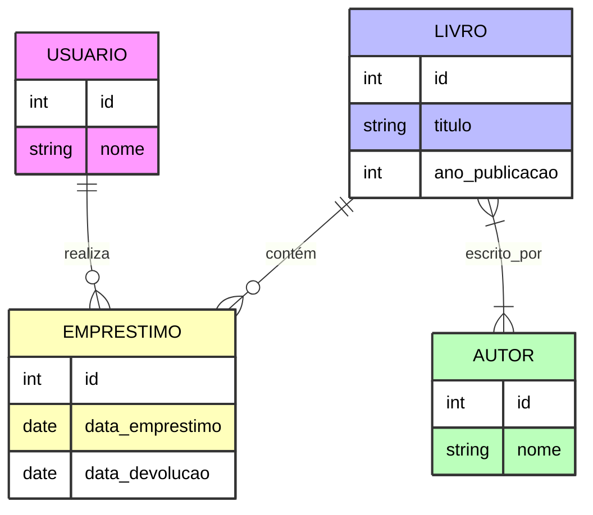

# Projeto de Banco de Dados - Sistema de Biblioteca

## Descrição do Projeto
Este projeto faz parte da disciplina **Projeto de Banco de Dados** e consiste na criação de um sistema de gerenciamento para uma biblioteca. O sistema permite gerenciar livros, autores, usuários e empréstimos, garantindo integridade dos dados e automatizando consultas e operações comuns.

O desenvolvimento do projeto foi organizado em quatro scripts principais:

---

### 1. Script `scheme.sql`
Neste script, foram criadas todas as tabelas do banco de dados, incluindo definições de chaves primárias, estrangeiras e restrições de integridade.  
Tabelas criadas:
- `Usuario` – cadastro dos usuários da biblioteca.
- `Livro` – informações sobre os livros disponíveis.
- `Autor` – cadastro dos autores dos livros.
- `Emprestimo` – registro de empréstimos de livros para os usuários.

---

### 2. Script `views.sql`
Foram criadas **views** para facilitar consultas frequentes. As views foram divididas em:

**Simples:**
- `livros_com_autores` – lista livros com informações dos autores.
- `usuarios_com_emprestimos` – lista de usuários com empréstimos ativos.
- `emprestimos_em_aberto` – empréstimos que ainda não foram devolvidos.

**Médias:**
- `historico_emprestimo` – histórico de todos os empréstimos realizados.
- `qtd_emprestimo_por_usuario` – quantidade de empréstimos por usuário.
- `livros_mais_recentes` – livros cadastrados mais recentemente.
- `usuarios_com_mais_de_um_emprestimo` – usuários que realizaram mais de um empréstimo.

---

### 3. Script `procedure.sql`
Contém **procedures** que automatizam operações do sistema, como:
- Registrar um novo empréstimo.
- Registrar quando um livro é devolvido .
- Cadastrar novos usuários, livros ou autores.
- Consultas automatizadas com parâmetros de entrada.

As procedures garantem consistência do banco e evitam repetição de comandos SQL.

---

### 4. Script `tests.sql`
Este script foi utilizado para testar as **views** e **procedures**, utilizando comandos `SELECT` e `CALL`:
- `SELECT * FROM livros_com_autores;`
- `SELECT * FROM emprestimos_em_aberto;`
- `CALL RegistrarEmprestimo(1, 10, '2025-09-01');`
- Outros testes de validação para as views médias e procedures do sistema.

---

## Tecnologias Utilizadas
- **Banco de Dados:** PostgreSQL
- **Ferramenta:** pgAdmin
- **Linguagem:** SQL para criação de tabelas, views, procedures e testes.

---

## 📌 Decisões de Negócio

1. **Priorização de campos essenciais**  
   Mantemos apenas os campos necessários para o funcionamento do sistema:  
   - `usuario`: `id`, `nome`  
   - `livro`: `id`, `titulo`, `ano_publicacao`  
   - `autor`: `id`, `nome`  
   - `emprestimo`: `id`, `data_emprestimo`, `data_devolucao`

2. **Padronização de nomenclatura**  
   Todas as tabelas e colunas seguem letras minúsculas e nomes claros para maior consistência e facilidade de manutenção.

3. **função adicional**
   Fazer com que a procedure "cadastrar_livro" também receba o nome do autor para cadastra-lo automaticamente caso seu id não esteja presente na tabela autor

---

## Modelo Relacional

---
## AUTOR
**Nome: JOSÉ ALVES LIMA NETO**

**Matrícula: 12400588**
